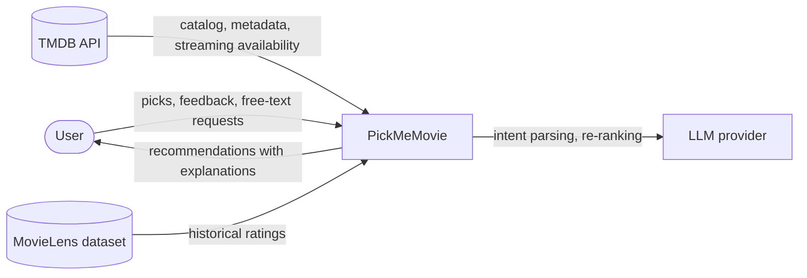
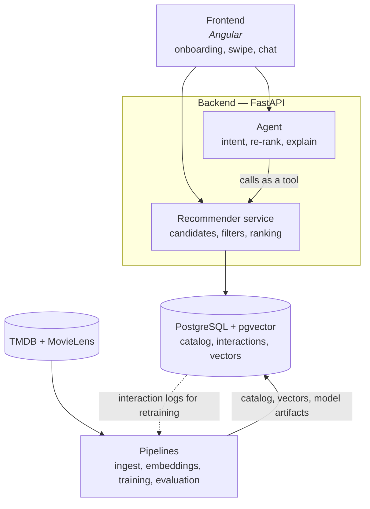
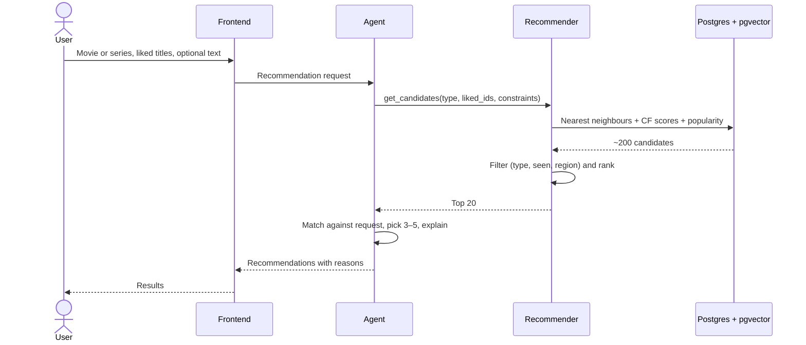

# Architecture

This document describes PickMeMovie using the first two levels of the [C4 model](https://c4model.com/): system context and containers. Decisions behind these choices are recorded in [adr/](adr/).

## 1. System context

## 2. Containers

| Container | Responsibility |
|---|---|
| Frontend | Onboarding (movie/series, liked titles), browsing recommendations, feedback, chat |
| Agent | Turns free-text requests into constraints, re-ranks top candidates, writes explanations |
| Recommender service | Candidate generation, filtering, ranking |
| PostgreSQL + pgvector | Title catalog, users and interactions, item embeddings with an HNSW index |
| Pipelines | Batch jobs: TMDB ingest, embedding computation, model training and offline evaluation |

The backend (online, latency-sensitive, light dependencies) and pipelines (batch, heavy dependencies such as PyTorch) are separate packages in one uv workspace so they can ship as separate Docker images.

## 3. Request flow

Without free text, the frontend can call the recommender directly and skip the agent.

## 4. Candidate sources

| Source | Covers | Notes |
|---|---|---|
| Content similarity | Movies and series | Embeddings of title, genres, keywords and synopsis. Works from day one with no interaction data. |
| Collaborative filtering (ALS) | Movies only, at first | Trained on MovieLens, which contains no TV series. Series get CF signal only once the app collects its own interactions. |
| Popularity | Everything | Fallback for cold-start users and sparse regions of the catalog. |
| Two-tower model (Phase 4) | Movies and series | Combines interaction signal with item features, addressing cold start for new titles. |

## 5. Data

- **TMDB** is the source of truth for the catalog. TMDB ID is the primary key for titles.
- **MovieLens** ratings are joined to the catalog through its `links.csv`, which maps MovieLens `movieId` to `tmdbId`.
- Streaming availability comes from TMDB watch providers for region `HR`.

## 6. Evaluation

Offline evaluation uses a time-based split of MovieLens interactions (train on the past, test on the future) and reports recall@k and NDCG@k. Every model is compared against the same baseline on the same split. The agent is evaluated separately on a synthetic set of free-text requests with expected constraints. Details will live in `docs/evaluation.md`.
